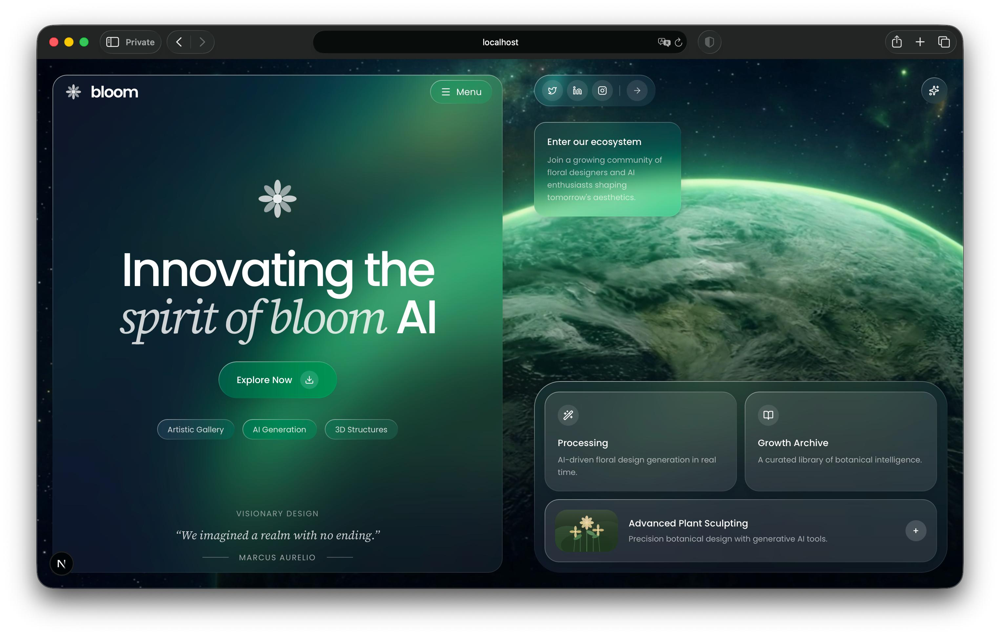

   



# liquid-glass-ui

A precision design system for glassmorphism hero sections over video backgrounds — built with Next.js, Tailwind CSS, and Three.js. Not "add a blur." Six dimensions, specified exactly.

---

## Why This Exists

Most glassmorphism tutorials stop at `backdrop-filter: blur()`. That produces mediocre results — flat, washed-out panels that look like a CSS trick rather than actual glass.

This system specifies **six dimensions simultaneously**. The combination is what makes the difference:

| Dimension | Rule |
|-----------|------|
| Glass tiers | 3 named tiers: `panel` / `card` / `pill` — each with exact blur, opacity, and shadow values |
| Border technique | `::before` + `padding: 1px` + `mask-composite: exclude` XOR trick — never a plain `border` |
| Color constraint | Strict grayscale only — the background video provides all color |
| Font strategy | Poppins for all structure; Source Serif 4 italic for h1 accent + pull quote only |
| Opacity hierarchy | white → /80 → /60 → /50 (text); /15 → /10 (bg); /30 (dividers) |
| Micro-interactions | `hover:scale-105 active:scale-95` on every interactive element, always |

When all six are applied together, the result doesn't look like a CSS trick. It looks like glass.

---

## Design Philosophy

> **The background provides all color. The glass panels stay achromatic.**

This constraint is what makes the design feel premium. When panels have no color of their own, they become *windows* rather than surfaces — revealing depth by showing what's behind them, not asserting what they are.

Every value in this system serves that constraint. Blur depths create foreground hierarchy. Opacity tiers create typographic hierarchy. The border gradient creates a light-from-top-left illusion of physicality.

---

## The Border Trick

This is the single most impactful technique. Instead of `border: 1px solid rgba(255,255,255,0.2)` — which looks flat — the XOR mask technique creates a border made of a *gradient*: lighter in the top-left, fading toward the bottom-right. This mimics how light physically hits glass.

```css
.glass-panel::before {
  content: '';
  position: absolute;
  inset: 0;
  padding: 1px;          /* This 1px becomes the border area */
  border-radius: inherit;
  pointer-events: none;

  /* XOR mask: reveals only the padding strip, not the content box */
  -webkit-mask: linear-gradient(#fff 0 0) content-box, linear-gradient(#fff 0 0);
  -webkit-mask-composite: xor;
  mask-composite: exclude;

  /* Gradient fills the border strip — lighter top-left, fades out */
  background: linear-gradient(160deg,
    rgba(255,255,255,0.5)  0%,
    rgba(255,255,255,0.15) 30%,
    transparent            55%,
    rgba(255,255,255,0.08) 100%
  );
}
```

The `mask-composite: exclude` means: *show the gradient where the padding box and content box do NOT overlap* — exactly the 1px strip. Zero `border` properties involved.

---

## Quick Start

1. Copy [`globals.css`](./globals.css) content into your project under `@layer components`
2. Copy [`components/`](./components/) into your project
3. Set up fonts in [`layout.tsx`](./examples/layout.tsx) — Poppins + Source Serif 4
4. Use [`examples/page.tsx`](./examples/page.tsx) as your starting point
5. Replace `VIDEO_URL`, `BRAND_NAME`, heading text, and card content with yours

Install the Three.js stack if you don't have it:

```bash
npm install three @react-three/fiber @react-three/drei
npm install -D @types/three
```

---

## File Reference

| File | Purpose |
|------|---------|
| [`globals.css`](./globals.css) | Complete 3-tier glass CSS — paste into `@layer components` |
| [`components/GlassScene.tsx`](./components/GlassScene.tsx) | Three.js video background with object-cover scaling |
| [`components/GlassSceneClient.tsx`](./components/GlassSceneClient.tsx) | SSR-safe `dynamic()` wrapper for Next.js App Router |
| [`examples/layout.tsx`](./examples/layout.tsx) | Font setup — Poppins + Source Serif 4 via `next/font/google` |
| [`examples/page.tsx`](./examples/page.tsx) | Full two-panel layout skeleton with inline comments |
| [`liquid-glass-ui.md`](./liquid-glass-ui.md) | Claude Code skill file — invoke with `/liquid-glass-ui` |
| [`PROMPT.md`](./PROMPT.md) | Standalone AI prompt — works with any LLM, not just Claude |

---

## Use with Claude Code

This repo ships a Claude Code skill file at [`liquid-glass-ui.md`](./liquid-glass-ui.md). Place it in `~/.claude/commands/` to invoke it with `/liquid-glass-ui` from any project.

```bash
cp liquid-glass-ui.md ~/.claude/commands/liquid-glass-ui.md
```

When invoked, the skill will:
1. Parse your design brief (brand, heading, CTA, cards, quote, background URL)
2. Check your project and install Three.js if needed
3. Write all files following this exact spec
4. Verify with `npx tsc --noEmit`

---

## Use the Prompt

Prefer to paste directly into any AI assistant? See [`PROMPT.md`](./PROMPT.md) — a standalone, annotated prompt that encodes all six dimensions. Fill in 8 parameters, paste it with your brief, and get Bloom-quality results from any capable LLM.

---

## Contributing

Feel free to use, adapt, and share this system. If you build something with it, contributions back to the repo are welcome — see [`CONTRIBUTING.md`](./CONTRIBUTING.md).

---

## License

MIT — see [`LICENSE`](./LICENSE)
